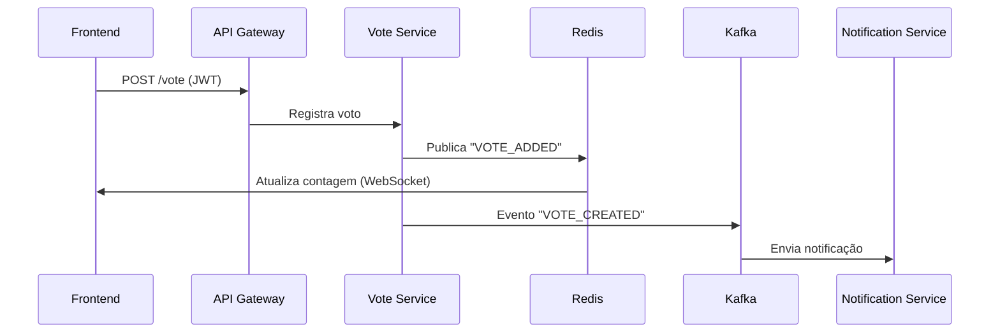
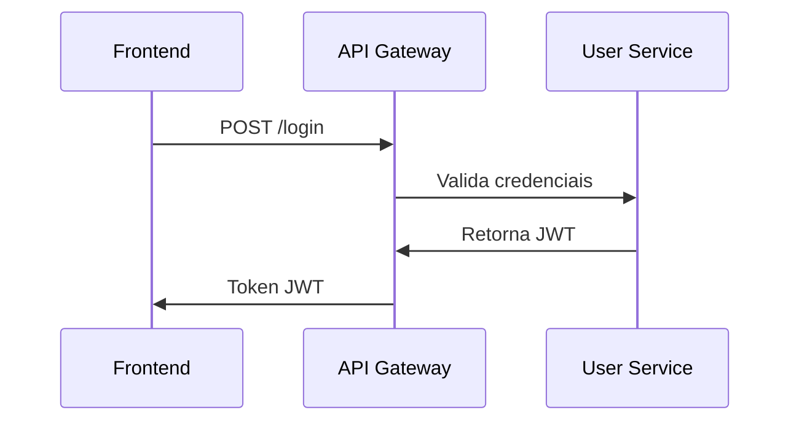

# **📌 Sistema de Votação em Tempo Real - Microsserviços**  

**🚀 Um sistema de votação escalável, seguro e em tempo real, baseado em microsserviços, com comunicação assíncrona e monitoramento completo.**  

---

## **📋 Sumário**  
1. [**Visão Geral**](#-visão-geral)  
2. [**Arquitetura do Sistema**](#-arquitetura-do-sistema)  
3. [**Microsserviços**](#-microsserviços)  
4. [**Tecnologias Utilizadas**](#-tecnologias-utilizadas)  
5. [**Autenticação e Segurança**](#-autenticação-e-segurança)  
6. [**Comunicação em Tempo Real (WebSocket)**](#-comunicação-em-tempo-real-websocket)  
7. [**Fluxos Principais**](#-fluxos-principais)  
8. [**Desenvolvimento Local (Docker Compose)**](#-desenvolvimento-local-docker-compose)  
9. [**Produção (Kubernetes/Cloud)**](#-produção-kubernetescloud)  
10. [**Monitoramento e Observabilidade**](#-monitoramento-e-observabilidade)  
11. [**Como Contribuir**](#-como-contribuir)  

---

## **🌐 Visão Geral**  
Um sistema completo onde os usuários podem:  
✅ **Criar votações** com múltiplas opções  
✅ **Votar em tempo real** (atualização via WebSocket)  
✅ **Acompanhar resultados dinâmicos** (gráficos e contagem ao vivo)  
✅ **Receber notificações** (email/WebSocket) sobre eventos  
✅ **Autenticação segura** via JWT  

---

## **🧱 Arquitetura do Sistema**  
### **📌 Padrão: Microsserviços com Banco de Dados por Serviço**  
- Cada microsserviço **gerencia seu próprio banco de dados** (PostgreSQL).  
- Comunicação **síncrona (HTTP/REST)** e **assíncrona (Kafka/RabbitMQ)**.  
- **Service Discovery (Eureka)** para registro dinâmico de serviços.  
- **API Gateway** como ponto único de entrada.  

 *(Diagrama da arquitetura)*  

### **🔹 Banco de Dados por Serviço**  
| Microsserviço          | Banco de Dados  | Observações                          |  
|------------------------|----------------|--------------------------------------|  
| **User Service**       | PostgreSQL (`user-db`) | Armazena usuários e credenciais. |  
| **Vote Service**       | PostgreSQL (`vote-db`) | Registra votos e opções.         |  
| **Notification Service** | Redis (eventos) | Gerencia filas de notificações.  |  

✅ **Vantagens**:  
- **Desacoplamento**: Falha em um serviço não derruba outros.  
- **Escalabilidade**: Cada banco pode ser otimizado separadamente.  

⚠ **Desafios**:  
- **Transações distribuídas**: Resolvido com **Padrão Saga** e **Eventual Consistency**.  

---

## **🛠 Microsserviços**  
| Serviço                          | Descrição                                                                 |  
|----------------------------------|---------------------------------------------------------------------------|  
| **API Gateway**                  | Roteamento, autenticação JWT e rate limiting.                            |  
| **Service Discovery (Eureka)**   | Registro dinâmico de microsserviços.                                     |  
| **User Service**                 | Cadastro, login e geração de JWT.                                        |  
| **Vote Service**                 | Registro de votos, contagem em tempo real (Redis + WebSocket).           |  
| **Notification Service**         | Envio de emails/notificações via eventos (Kafka).                        |  
| **Frontend (React)**             | Interface interativa com gráficos em tempo real.                          |  

---

## **⚙ Tecnologias Utilizadas**  
| Categoria       | Tecnologias                                                                 |  
|----------------|-----------------------------------------------------------------------------|  
| **Backend**    | Java 21, Spring Boot, Spring Cloud Gateway, Spring Security, Eureka         |  
| **Banco de Dados** | PostgreSQL (por serviço), Redis (cache/eventos)                          |  
| **Mensageria** | Kafka / RabbitMQ (eventos assíncronos)                                      |  
| **Frontend**   | React.js, Axios, WebSocket, Chart.js                                        |  
| **Monitoramento** | Prometheus, Grafana, Zipkin (tracing distribuído)                         |  
| **Infra**      | Docker, Docker Compose, Kubernetes (produção)                               |  

---

## **🔐 Autenticação e Segurança**  
- **JWT (JSON Web Token)** para autenticação stateless.  
- **Spring Security** no backend.  
- Tokens enviados no header:  
  ```http
  Authorization: Bearer <token>
  ```

---

## **🔄 Comunicação em Tempo Real (WebSocket)**  
- **Redis Pub/Sub**: Atualiza contagem de votos em tempo real.  
- **Frontend (React)**: Mantém conexão WebSocket para receber atualizações.  

---

## **⚡ Fluxos Principais**  
### **1. Votação em Tempo Real**  


### **2. Autenticação**  


---

## **🛠 Desenvolvimento Local (Docker Compose)**  
```bash
git clone https://github.com/SdneyFernandes/voting-system.git
cd voting-system
docker-compose up -d  # Sobe todos os serviços
```
**Acesse:**  
- **Frontend**: `http://localhost:3000`  
- **API Gateway**: `http://localhost:8080`  
- **Grafana**: `http://localhost:3001`  

---

## **🚀 Produção (Kubernetes/Cloud)**  
- **Kubernetes**: Helm charts para deploy automatizado.  
- **Cloud**: AWS EKS / GCP GKE com auto-scaling.  
- **Banco de Dados**: RDS (PostgreSQL) + ElastiCache (Redis).  

---

## **📊 Monitoramento e Observabilidade**  
| Ferramenta       | Função                                                                 |  
|------------------|-----------------------------------------------------------------------|  
| **Prometheus**   | Coleta métricas de microsserviços.                                    |  
| **Grafana**     | Dashboards em tempo real (ex: votos por minuto).                      |  
| **Zipkin**      | Tracing distribuído (monitora requisições entre serviços).            |  

---

## **🤝 Como Contribuir**  
1. **Faça um fork** do projeto.  
2. **Crie uma branch**:  
   ```bash
   git checkout -b feature/nova-funcionalidade
   ```  
3. **Envie um PR** com suas alterações.  

---

**🎯 Objetivo**: Criar um sistema de votação **escalável, seguro e em tempo real**, pronto para produção.  

🚀 **Happy Coding!**
